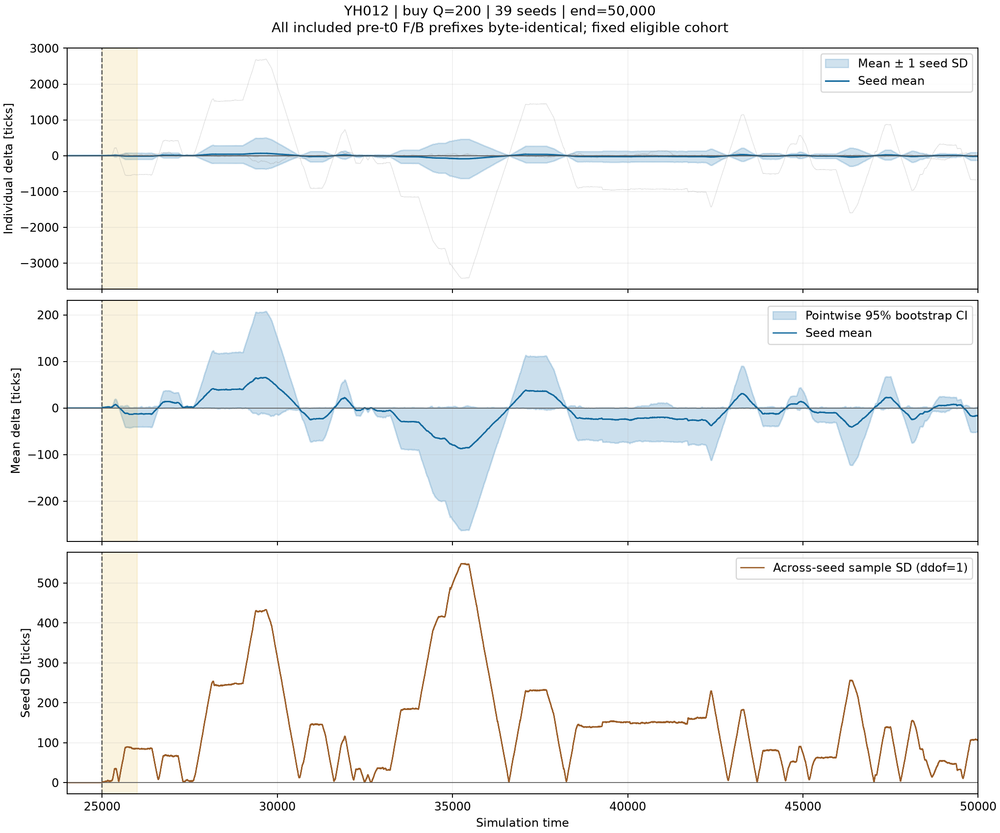
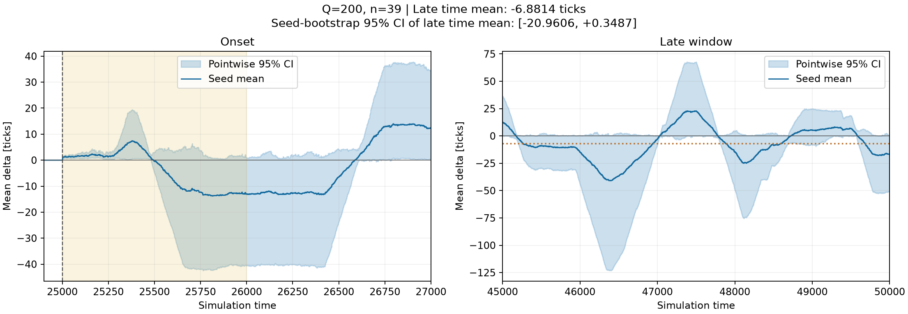
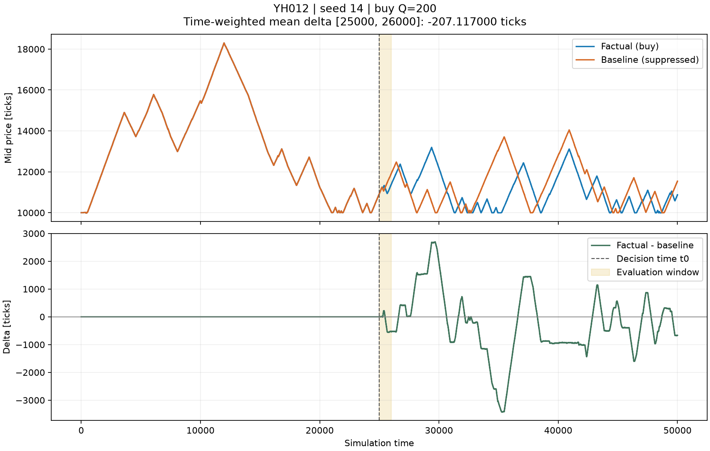

# Q=200・適格39 seed の平均 — 2026-09-06

**全39 seed で介入前の生バイト一致を確認。平均後も大きな正負の変動が残り、滑らかな減衰や終盤のゼロ収束は確認できなかった。**
終盤の時間平均は **−6.8814 ticks、seed 間標準偏差43.0756、95%信頼区間 [−20.9606, +0.3487]**。
この標準偏差は各 seed の終盤時間平均のばらつきであり、時刻ごとの標準偏差とは区別する。
信頼区間がゼロを含むことは、ゼロ収束や永続成分ゼロの証明ではない。





## 固定した実験と検証

- 候補 seed 0〜39。固定時刻 t0=25,000 にネイティブ best_ask がない候補を除外する基準を、平均の再実行前に採用。
- 保存済みの40 seed の背景気配・ログ・メタデータ・背景コードを照合し、基準に該当した seed 13 のみ除外。適格39件で新しい F/B ペアを実行。
- この基準は流動性診断後に採用したもの。測定対象は「t0 に売り板がある背景市場」で条件付けた平均であり、候補40件全体の無条件平均ではない。
- t0=25,000、t1=26,000、end_time=50,000、買い Q=200、指値 best_ask+2、背景エージェント100体を維持。発注を待つ処理やモデル変更はない。
- 4プロセス、実行時間1,749.606秒（約29分10秒）。終了時刻の短縮・計算時間による seed の除外はない。
- 各 seed は `Experiment.run_pair(suppress_agent_ids=[100])` を使い、F/B を `write_log_file` で保存してから介入前を判定。
- **39/39件で厳密な `logs_byte_equal` と元バッファの比較がともに成功。比較した介入前ログの合計は片腕99,829,920バイト。**
- 集計前に全保存ログの SHA-256・ExperimentMeta・介入前証明を再検証。別途 `read_log_file` でも78ファイルの全レコードバイト保持と、39ペアの厳密なヘルパー比較を確認。
- 全78ログ、合計4,569,932レコードを保存。各 ExperimentMeta の lobcore_version は `6aff004bf77cc7c70aceea6e409f8155f7cd94ce`。実行時の FAL は `7f71f9e450978ffc73a2c711a9591cd43018869a`。

適格性の40件の観測値・理由・元データのハッシュは [plan.json](plan.json)、
実行環境と拡張バイナリのハッシュは [runtime.json](runtime.json)、
ファイル読込の追加検証は [readback_verification.json](readback_verification.json) に保存した。
再解析に用いた訂正後コードのコミット・ハッシュは [analysis_provenance.json](analysis_provenance.json) に記録。
シミュレーション時の原本と、後からログだけを使って訂正した数量集計の由来を区別している。

## 時間構造

介入の決定時刻25,000では平均Δ=0。到着後の25,001では **+0.5513 ticks**
（時刻別95% CI [0.2051, 0.9487]）、25,002では **+1.0385 ticks**（[0.6282, 1.4872]）となり、
最初の価格上昇は観測できた。その後は正負に大きく振れ、単調な減衰になっていない。
周期性を検定した結果ではなく、観測された正負の変動として記述する。

| 時間窓 [start,end) | 平均Δ [ticks] | seed ごとの窓平均の標準偏差 | 平均の95%信頼区間 |
|---|---:|---:|---:|
| [25,000, 26,000) | -3.8715 | 33.6071 | [-15.1753, +2.4295] |
| [26,000, 30,000) | +25.9524 | 162.5016 | [-0.9907, +78.5133] |
| [30,000, 35,000) | -15.1460 | 93.9303 | [-45.4877, +0.3102] |
| [35,000, 40,000) | -16.8340 | 106.3200 | [-50.9771, +0.3351] |
| [40,000, 45,000) | -11.2229 | 73.6297 | [-35.1672, +1.2464] |
| [45,000, 50,000) | -6.8814 | 43.0756 | [-20.9606, +0.3487] |
| [25,000, 50,000) | -6.0193 | 38.7191 | [-18.5253, +0.3247] |

初期評価窓の平均が正の seed は28、ゼロは7、負は4。
しかし39件全体の窓平均は **−3.8715 ticks** で、「初期窓の平均Δ > 0」は今回の集合では満たさなかった。
介入前の同一性は満たしており、この符号を理由に seed を取り除いてはいない。

平均軌跡の最大は **+65.3846 ticks（t=29,638）**、最小は **−87.3718 ticks（t=35,249）**。
以前の単一 seed 42 で見えた +8 / −8.5 の振れが、今回の平均で小さくなる結果にはならなかった。
なお、seed 42 は今回の候補0〜39には含まれず、単一実行との参照比較である。

終盤の平均軌跡は **[−40.8846, +22.8846] ticks** の間を動き、
最終時刻の平均は **−16.7308 ticks**、その時刻の seed 間標準偏差は **106.3851**、
時刻別95% CI は **[−51.0641, +0.6923]**。
終盤全体で各自のΔが厳密にゼロだった seed は6/39件。
終盤の時間平均を Δ∞ の有限観測窓による代理推定値とするなら −6.8814 ticks だが、
ゼロからの差も無限時間の極限も今回だけでは確定できない。

## 大きな変動をもたらした seed 14

seed 14 は t0 に bid=10,932・数量2、ask=10,934・数量5 があり、事前基準では適格。
この seed の介入前比較は81,393レコード・7,813,728バイトで一致した。
初期窓の保存スナップショットには F/B とも片側気配のレコードがなく、
この窓の大きな差は一方の気配で mid を代用した結果ではない。

この seed のΔは全観測期間で **+2,696〜−3,426 ticks** に達した。
初期窓の時間平均は −207.1170、終盤の時間平均は −268.7741。
39 seed の終盤平均への加算項は −268.7741/39 = **−6.8916 ticks** であり、
終盤の seed 間平方偏差総和の **97.27%** をこの1件が占める。
平均・不確実性ともに、この乱数実現の影響が非常に大きい。
また seed 33 でも +149〜−233 ticks の変動があった。



[seed 14 の初期窓拡大](seed14_window.png) も保存した。
買い注文後に背景の価格経路が大きく分岐したことは確認できるが、
背景エージェント間のどの連鎖がその形を生んだかの因果分解は今回行っていない。
seed 14 は番号・Δの大きさ・符号による事後除外をせず、39件の平均と信頼区間に含めた。

Q は発注数量であり、全量約定を保証する市場注文ではない。
初回の taker 約定が200未満だった seed は10件あるが、残った指値は後で maker としても約定する。
両方を合計すると、最終時刻までに **38 seed が200/200約定し、seed 6 のみ92/200**
（taker 45 + maker 47）だった。seed 14 は taker 11 + maker 189 = 200。
全件を集計に含めた。今回は「200を発注する介入」の平均であり、
「200を必ず約定させる介入」の平均ではない。

集計時に、既存 `run_impact` が taker 約定だけを `impact_executed_qty` として数えていた問題を発見した。
今後の実行と保存ログの再解析では、order_id / maker_id のどちらに Impact が現れるかで全約定を集計するよう修正。
今回の原本 `logs/seedNNNN.tar.gz` 内の実行時 summary.json は当時の出力をそのまま保存したため、
その数量欄は旧方式の taker 分のみ。**訂正後の総約定量は本レポート直下の summary.json の per_seed に記録**し、
taker / maker の内訳も併記した。原本のバイナリログ・メタデータ・SHA-256 は変更していない。
数量集計の訂正前後で `ensemble_paths.npz` の SHA-256 が同一であることを確認し、
各Δ・平均・標準偏差・信頼区間に変化がないことも検証した。

## 統計量と保存物

共通の整数グリッドで直前のログ気配を保持し、seed ごとのΔを算出した。
気配は既存 Phase 3 と同じ受付直前スナップショットで、時刻内の最後のレコードを採用。
既存の片側気配への代用規則も維持した。全適格 seed の介入後データ被覆を要求し、欠測のゼロ埋めはしていない。
窓の時間平均は [start,end) のステップ関数積分で、元のイベント時刻による積分とも照合した。

標本標準偏差は ddof=1、標準誤差は SD/√39。
信頼区間は39 seed の軌跡全体を4,000回再標本化する percentile bootstrap
（解析用 seed=20260905）。全時刻に共通の再標本化重みを使い、
図の帯は時刻ごとの95%区間であって同時信頼帯ではない。
終盤の信頼区間は各 seed の時間平均を再標本化し、時刻を独立標本とは数えていない。

- [summary.json](summary.json): 窓統計、各 seed の証明・メタデータ・ハッシュ・極値。
- [ensemble_paths.npz](ensemble_paths.npz): times、seeds、各Δ、mean、sd、se、ci_low、ci_high、n_finite。
- [log_manifest.json](log_manifest.json): 各 seed の圧縮ファイルとメンバーの SHA-256・バイト数。
- `logs/seedNNNN.tar.gz`: 元の factual.bin / baseline.bin / config.yaml / summary.json。再生成やパディングの正規化はせず、解凍後の全バイトを元ファイルと照合。
- [padding_roundtrip_verification.json](padding_roundtrip_verification.json): 修正前に実際に差が出た非ゼロパディングを含む70,715レコードでも、修正後の保存→読込で全6,788,640バイトが保持されることを確認した証明。

アーカイブは元ファイル合計438,940,830バイトを47,126,067バイトへ圧縮した。

保存ペアからの再解析（FAL ルートで実行）:

```bash
mkdir -p experiments/YH012/artifacts/ensemble_q200_eligible39_restored
for archive in experiments/YH012/reports/ensemble_q200_eligible39/logs/*.tar.gz; do
  tar -xzf "$archive" -C experiments/YH012/artifacts/ensemble_q200_eligible39_restored
done
cp experiments/YH012/reports/ensemble_q200_eligible39/plan.json experiments/YH012/artifacts/ensemble_q200_eligible39_restored/
cp experiments/YH012/reports/ensemble_q200_eligible39/progress.json experiments/YH012/artifacts/ensemble_q200_eligible39_restored/
.venv/bin/python -m experiments.YH012.analyze_ensemble \
  --run-dir experiments/YH012/artifacts/ensemble_q200_eligible39_restored \
  --out-dir experiments/YH012/artifacts/ensemble_q200_eligible39_reanalysis
```

padding 修正の検証は Python 62件、C++ Debug ASan/UBSan 79件が通過。
適格性判定の追加後は関連する ensemble テスト13件が通過。
約定数量の訂正後は、ensemble・impact・保存ペアの関連テスト32件が通過。
lobcore の GitHub CI は Ubuntu/macOS C++、Ubuntu Python、Release/bench の全ジョブ成功。
