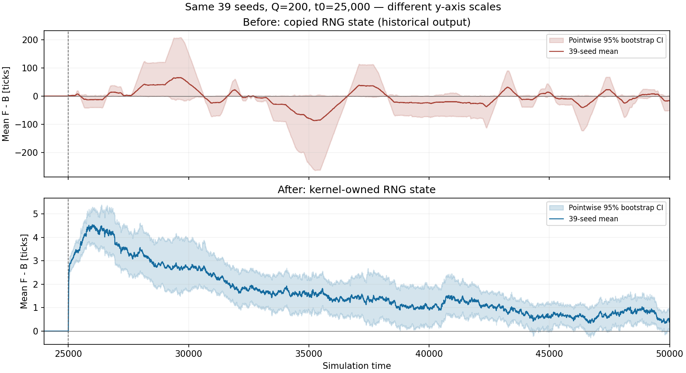
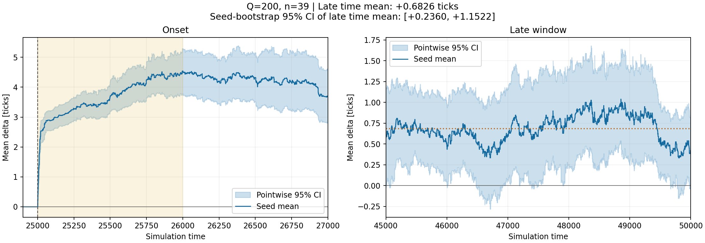
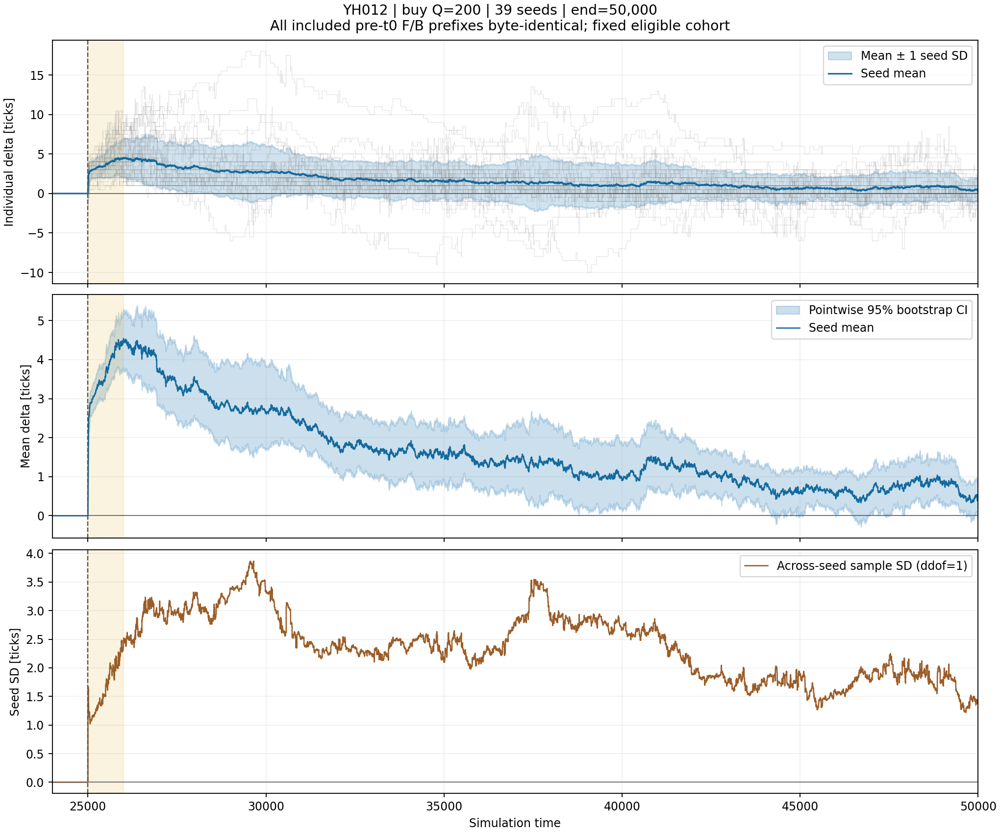
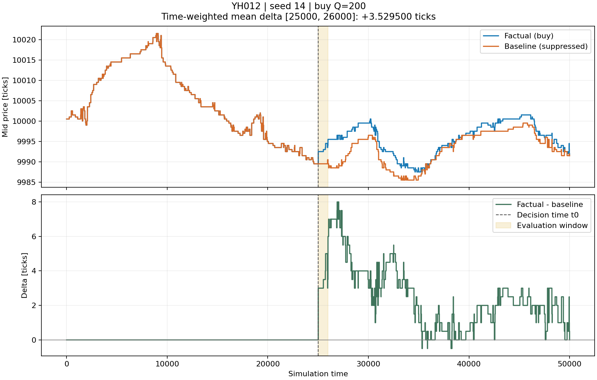

# RNG修正後・同一39 seedの再実験 — 2026-09-17

**全39 seedを変更せず再実行し、全件で介入前F/Bログのバイト一致を確認した。**
初期窓の平均差は **+3.6467 ticks（95% CI [+3.1873, +4.1000]）**、
終盤の時間平均は **+0.6826 ticks（[+0.2360, +1.1522]）**。
旧版を支配していたseed14の巨大な価格差は再現されず、平均差は時間とともに縮小した。
ただし、観測期間内のゼロ収束や、無限時間の極限は確認していない。



## 修正と固定した条件

- lobcore修正コミット：[`3f5fa20`](https://github.com/yuitokyouni/lobcore/commit/3f5fa20b1e9424e41a16a5a93b1fabd697b3b283)。
  Pythonの`rng_for` / `sentinel_rng`が核の乱数状態を参照で返すように修正。
  [原因・回帰テスト](https://github.com/yuitokyouni/lobcore/blob/main/docs/python-rng-correction.md)。
- 実行時financial-abm-lab：[`cb32ada`](https://github.com/yuitokyouni/financial-abm-lab/commit/cb32ada2ae79982d49a9997c053317dbf66b8535)。
- 旧planの39 seed（0〜39のうち13以外）をそのまま使用。新たな除外・置換・符号による選別なし。
  **seed13が修正後も不適格だという意味ではない。** 今回は旧実験との比較のため標本を固定した。
- 背景100体（fundamentalist30/chartist25/noise45）、t0=25,000、t1=26,000、終了50,000。
  買い指値Q=200、価格はt0のbest ask+2。背景モデル・パラメータ・解析設定は旧planと同一。
- 各seedで介入前に背景だけをt0まで実行し、注文を出さない観測者からネイティブ気配を取得。
  39件すべてでbest askあり。観測者の位置はImpactAgentと同じID=100。
  ask不在なら全体を停止する手順であり、標本を減らして成功扱いにはしない。

## 結果

| 時間窓 [start,end) | 平均差 [ticks] | seedごとの窓平均のSD | 平均の95% bootstrap CI |
|---|---:|---:|---:|
| [25,000,26,000) | +3.6467 | 1.5157 | [+3.1873,+4.1000] |
| [26,000,30,000) | +3.3426 | 2.6628 | [+2.5649,+4.2098] |
| [30,000,35,000) | +1.9568 | 2.1665 | [+1.3312,+2.6947] |
| [35,000,40,000) | +1.3022 | 2.2065 | [+0.6430,+2.0050] |
| [40,000,45,000) | +1.0067 | 1.6392 | [+0.5394,+1.5476] |
| [45,000,50,000) | +0.6826 | 1.4882 | [+0.2360,+1.1522] |

初期窓の時間平均は39/39件で正。平均軌跡の最大は+4.5385 ticks（t=25,997）。
終盤の平均軌跡は+0.3333〜+1.0385 ticksの範囲。最終時刻の平均は+0.4103 ticks。
全seedの個別差分の極値は−10〜+18 ticks。

seed14の差分範囲は **旧−3,426〜+2,696 → 新−0.5〜+8 ticks**。
旧版の初期窓平均−3.8715、終盤平均−6.8814という集合結果は、
修正前の乱数実装を含む保存記録として扱う。新しい結果で旧ログを書き換えてはいない。







発注量と約定量は異なる。終了時刻までに33/39件で200全量が約定し、
残る6件はseed0=121、1=122、3=19、6=17、27=37、31=20だった。
takerと残存注文のmaker約定を合計した値で、未約定を理由に除外していない。
したがって測っているのは「200の指値を発注する介入」であり、
200の即時全量約定や、残存注文を取り消した介入ではない。

## 検証と解釈の範囲

- 39/39の介入前ログがF/Bでバイト一致。比較した片腕の合計17,777,376バイト。
- 保存した78ログは合計770,757レコード。全件のSHA-256・メタデータ・介入前証明を再検証。
- 事前気配確認の背景ログは、対応するFactualのt0までのログと全39件で一致。
  そのレコード本体はFactualアーカイブの`received_at <= t0`部分に保存されている。
- 同一コード・設定による別実行とも、78個のバイナリファイル全体が一致。
- 元ファイル74,222,719バイトをseed別tar.gzに圧縮（計9,679,498バイト）。
  展開した全バイトを元ファイルと比較した。
- 整数グリッドへの整列は直前値保持。介入後は39件すべての被覆を要求し、欠測のゼロ埋めなし。
  窓平均は元のイベント時刻での時間積分とも照合。
- 信頼区間はseed軌跡全体を4,000回再標本化するpercentile bootstrap（解析seed=20260905）。
  図の帯は時刻別であり、全時刻を同時に保証しない。時間点を独立標本とは数えない。
- 旧版の選択で決まった同一39 seedの比較。修正後の全候補母集団について新たに設計した標本ではない。
  終盤の窓平均の区間が正でも、永久的なインパクトや実市場への適合を実証したことにはならない。
  他参加者の反応と板への直接作用の因果分解は今回の範囲外。

ローカル検証：lobcore Python43件、C++ Debug ASan/UBSan79件、YH012関連37件が通過。
ホストのptrace制約でローカルのLeakSanitizerのみ無効。ASan/UBSanは有効。
GitHubの[同コミットのCI](https://github.com/yuitokyouni/lobcore/actions/runs/35172589264)では、
PythonとUbuntu/macOSのC++テストが成功している。

## 保存物と再実行

- [plan.json](plan.json)：旧planのハッシュ、固定したseed・設定、実行コードのコミットとハッシュ。
- [runtime.json](runtime.json)：Python・プラットフォーム・拡張バイナリのSHA-256。
- [preflight.json](preflight.json)：39件の介入前ネイティブ気配・背景ログのメタデータとハッシュ。
- [summary.json](summary.json)、[ensemble_paths.npz](ensemble_paths.npz)：各seedの差分、平均、SD、SE、CI、窓統計。
- [verification.json](verification.json)：事前確認とFactualの一致、別実行との全バイト一致。
- [log_manifest.json](log_manifest.json)、[logs/](logs/)：78個の元F/Bファイルと設定・実行要約のseed別アーカイブ。

旧版：[2026-09-06保存結果](../ensemble_q200_eligible39/README.md)。

両リポジトリを更新し、lobcore Python拡張を再ビルドしてからFALルートで実行する。
`LOBCORE_ROOT`は更新したlobcoreクローンを指すこと。

```bash
python -m experiments.YH012.rerun_fixed_cohort \
  --previous-plan experiments/YH012/reports/ensemble_q200_eligible39/plan.json \
  --out-dir experiments/YH012/artifacts/rng_fixed39_reproduction --workers 4
python -m experiments.YH012.analyze_ensemble \
  --run-dir experiments/YH012/artifacts/rng_fixed39_reproduction \
  --out-dir experiments/YH012/artifacts/rng_fixed39_reanalysis
python -m experiments.YH012.archive_ensemble \
  --run-dir experiments/YH012/artifacts/rng_fixed39_reproduction \
  --out-dir experiments/YH012/artifacts/rng_fixed39_reanalysis
```
