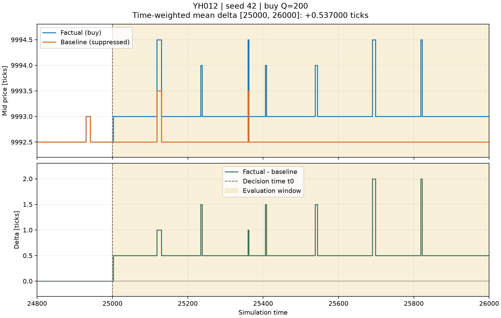
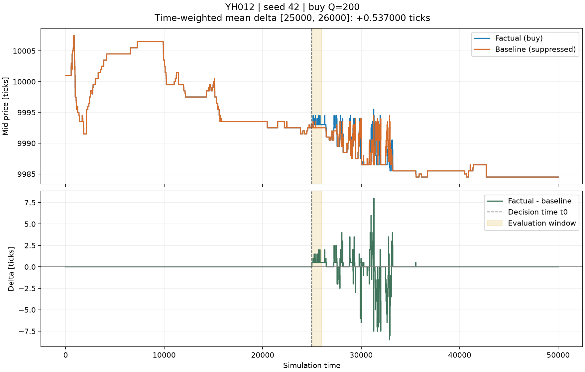

# YH012 Phase 2–3 — seed 42 の反実仮想 PoC

2026-09-05、Mac（arm64）で実行。単一買い注文を抑制した Baseline と Factual を比較し、
**介入前の生バイト完全一致、評価窓の時間平均 Δ>0 をともに確認した。**
数値・環境情報・両 `ExperimentMeta` は [機械可読レポート](phase23_seed42.json) に保存。
`write_log_file` で生成した **F/B の元ファイル**も、
[ログアーカイブ](phase23_seed42_logs.tar.gz) として Git 管理・push 対象にした。
`artifacts/` 内のローカル実行結果だけに依存せず、正本から再解析できる。

## 前提とコード

- lobcore PR #23 はマージ済み。使用コミットは `4fb83dcb2c0d17cc5239816606d2ec4cc0e3fabf`。
  Mac クローンを pull し、YH012 の仮想環境へ editable で再ビルドした。
- YH012 の `_order_seq` / `_next_order_id` を削除。背景エージェントと ImpactAgent は
  `Context.submit` の自動採番を使用する。
- `ImpactExperiment` は lobcore の `Experiment.run_pair(suppress_agent_ids=[100])` を使用。
  `_run_once` で World、Chartist 履歴、起床カウンタ、BatchAdapter、sentinel 系列を毎回新規生成。
- `financial-abm-lab-main` は GitHub 正本に接続された Git worktree。元クローンと
  Git 管理領域・origin を共有し、main をチェックアウトしている。WSL のファイルコピーではない。

## 条件と結果

背景は Phase 1 と同じ 30 Fundamentalist / 25 Chartist / 45 NoiseTrader。
seed=42、終了時刻50,000、Impact ID=100、t0=25,000、t1=26,000。
最良 ask+2ティックの買い指値を1本発注。意思決定25,000、受付25,001。

| 試行 | Q | 平均 Δ [ティック] | 判定 |
|---|---:|---:|---|
| 初回 | 50 | 0.000000 | 正の平均基準は未達 |
| 採用 PoC | 200 | **+0.537000** | 合格 |

初回の受付時最良 ask は価格9,994、数量153だった。Q=50はこの価格水準を消費し切れない。
時刻・評価窓・指値条件を維持し、数量のみ200に変更した。初回の設定
[`impact_seed42_q50.yaml`](../configs/impact_seed42_q50.yaml) と結果も保存している。
Q=200は200すべてが約定（81件の Fill）。両実行とも Reject は0件。

| 検証 | 結果 |
|---|---|
| t<t0 の `logs_byte_equal` | True |
| t<t0 の生バイト比較 | **20,570レコード / 1,974,720バイト完全一致** |
| 介入前ログの SHA-256 | `194108d4de64c6928660a0d04ca2a5b845c473a1210d9e9c9762f7508c711cc2` |
| F/B の lobcore コミット記録 | 両方とも上記40桁 hash |
| 独立した再実行 | F/B バイナリファイル全体・状態ハッシュ・ログ SHA-256 が一致 |
| 既存 Phase 1 との比較 | Baseline のログ全フィールドと状態ハッシュが一致 |
| テスト | YH012 と lobcore Python を合わせて **37 passed** |
| 静的検査・依存整合 | ruff / git diff --check / uv pip check 通過 |

| 実行 | レコード数 | Fill 数 | 最終状態ハッシュ |
|---|---:|---:|---|
| Factual | 43,993 | 9,032 | `1925857981061294172` |
| Baseline | 43,858 | 8,917 | `15247905874259579476` |

ログ本体（JSON メタデータヘッダーを除く）の SHA-256:

- Factual: `d940cd31142ee3d2f27ebfb5704b3e6fd9a22f766476b3421247f518dcafbe10`
- Baseline: `fc2fe1e3e4b5907ff54e4c8277d62c36c8c4618a6b87c00f45d20816bc4842ed`

## 図と指標の定義





図は matplotlib のみで生成。`mid_series` の受付直前スナップショットを使い、
同時刻の最後の観測を採用する。F/B の観測時刻の和集合上で直前値を保持し、
Δ=m_F−m_B を計算する。空板を価格0で埋めたり、将来値を過去へ埋めたりしない。
平均は窓内の区間長で重み付けする。現在の PoC の評価窓に欠測はない。

正の平均は指定した評価窓の結果であり、全期間で Δ が正という主張ではない。
この背景モデル・seed における実装 PoC で、実市場への較正や普遍的インパクト則の検証は行っていない。

## 保存ログから調べた時間構造

F/B の保存ファイルを再読込し、各ログの SHA-256・`ExperimentMeta`・介入前の生バイト一致を
再検証してから計算した。[再解析の数値](phase23_seed42_time_structure.json) も保存している。
シミュレーションの再実行や、図の目視からの数値推測は行っていない。

| 時点・期間 | Δ [ティック] | 解釈 |
|---|---:|---|
| 25,002 | +0.5 | 最初の非ゼロ観測。発注意思決定25,000、受付25,001の後 |
| 26,450 | 0 | 初回のゼロ復帰。その後、再び正負に動く |
| 31,298 | +8.0 | 観測期間内の最大値 |
| 32,884 | −8.5 | 観測期間内の最小値 |
| 35,561〜50,000 | 0 | ここから終了まで価格差はゼロ |
| 45,000〜50,000 の時間平均 | 0 | 終盤の残存価格差の代理指標 |

| 集計区間 | 時間平均 Δ [ティック] |
|---|---:|
| 25,000〜26,000 | +0.537000 |
| 26,000〜30,000 | +0.141750 |
| 30,000〜35,000 | −0.401300 |
| 35,000〜40,000 | +0.003100 |
| 40,000〜45,000 | 0 |
| 45,000〜50,000 | 0 |
| 介入後全期間 25,000〜50,000 | −0.035480 |

この seed と観測期間では、**一時的な価格インパクトと、その後の非単調な応答**が見える。
初回ゼロ復帰をそのまま減衰完了とは扱えない。観測期間末に正の価格差の高止まりはないが、
有限期間なので Δ∞=0 を証明したわけではない。
また最終状態ハッシュは F/B で異なる。価格差が消えたことは板全体の状態が一致したことを意味しない。

Phase 4 の Q スイープは未実施。実施時には初期・ピーク・終盤のどの Δ を数量と比較するかを
分け、複数 seed でも調べる必要がある。この Q=200・単一 seed の結果から平方根則の成否は判断しない。

## 元ログの復元と再解析

アーカイブには `factual.bin`（4,224,104 bytes）、`baseline.bin`（4,211,147 bytes）、
`summary.json`、設定 YAML、時間構造 JSON、ファイル全体の SHA-256 を記した `manifest.json` を含む。
圧縮・展開後の各ファイルが元ファイルと全バイト一致すること、展開したログでも
介入前比較が通ることを確認した。両バイナリのヘッダーには lobcore の40桁コミットハッシュが入っている。

```bash
mkdir -p experiments/YH012/artifacts/restored_seed42
tar -xzf experiments/YH012/reports/phase23_seed42_logs.tar.gz -C experiments/YH012/artifacts/restored_seed42
.venv/bin/python -m experiments.YH012.inspect_saved_pair --run-dir experiments/YH012/artifacts/restored_seed42
```

`read_verified_log` は保存された生 bytes を保持するため、NumPy の構造化配列コピーによる
パディング変化を避けて照合できる。再解析部分と既存の impact テスト計18件が通過。
上記37件のシミュレータ検証後、今回シミュレーションコードは変更していない。

## バイト比較の実装上の注意

現行 lobcore の `logs_byte_equal` は NumPy の構造化配列のフィールド比較で、
アラインメント用パディングを比較しない。YH012 は同ヘルパーに加えて
元ログの生バイトも比較する。核から受け取った配列には `.copy()` をかけず、
生 bytes を保持してパディングの未初期化を防ぐ。
テストではパディングだけを変更したログも拒否することを確認した。

CLI は介入前不一致なら終了コード2で停止し、Δ の分析と図の生成に進まない。
故意に不一致を注入したテストで、この停止動作も検証している。

## WSL での再現

リポジトリ直下で、Mac での作業を終えて push 済みの main を取得してから実行する。

```bash
git pull --ff-only
git -C ../lobcore pull --ff-only
uv pip install --python .venv/bin/python --reinstall-package lobcore --no-deps -e ../lobcore/python
uv pip install --python .venv/bin/python -e ../lobcore/python -e "experiments/YH012[test]"
.venv/bin/python -m pytest experiments/YH012/tests ../lobcore/python/tests -q
.venv/bin/python -m experiments.YH012.run_impact
```

`.venv` がなければ先に `uv venv --python 3.12 .venv`。
出力 `artifacts/impact_seed42_q200/summary.json` の `prefix`、
両 `arms` の `log_sha256`・`state_hash`・`meta.lobcore_version` を本レポートと比較する。
Mac 内の再現は確認済み。WSL での Phase 2–3 再実行は今回行っておらず、
環境間のログ完全一致はその照合が済むまで未確認とする。
